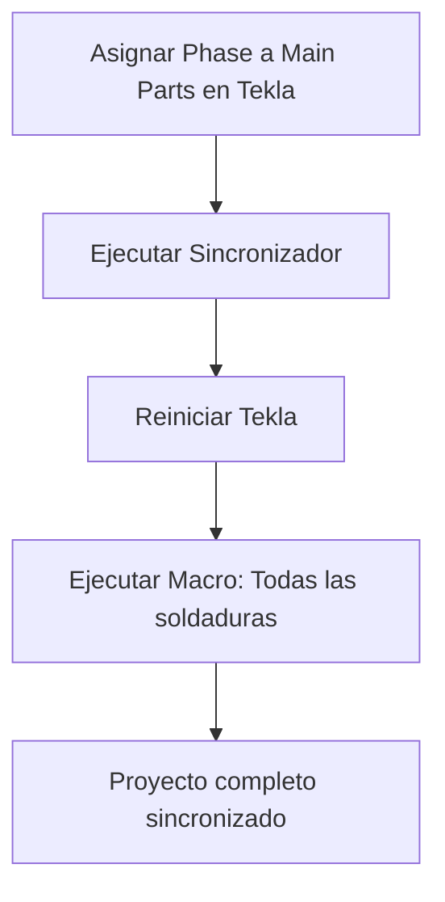
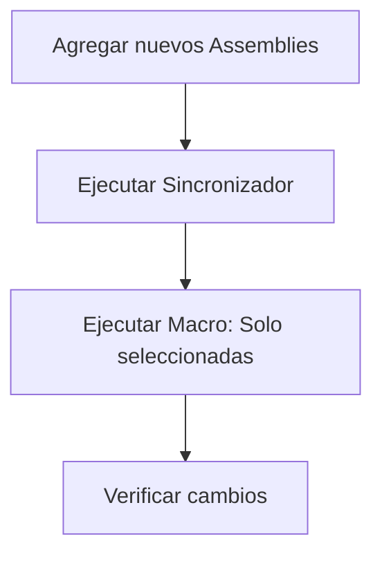
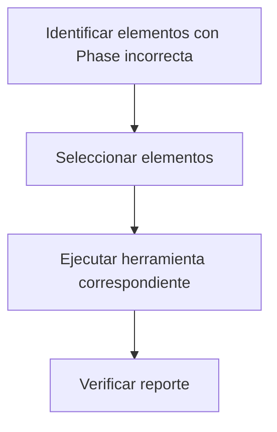

# ?? Corrector de Atributos Tekla

Sistema automatizado para sincronización de atributos Phase en Tekla Structures, diseñado para mantener la coherencia de fases entre Main Parts, Secondary Parts, Bolts y Welds dentro de los Assemblies.

## ?? Tabla de Contenidos

- [Descripción General](#-descripción-general)
- [Características](#-características)
- [Requisitos del Sistema](#-requisitos-del-sistema)
- [Estructura del Proyecto](#-estructura-del-proyecto)
- [Instalación](#-instalación)
- [Uso](#-uso)
- [Arquitectura y Componentes](#-arquitectura-y-componentes)
- [Flujo de Trabajo](#-flujo-de-trabajo)
- [Documentación Adicional](#-documentación-adicional)
- [Solución de Problemas](#-solución-de-problemas)
- [Contribución](#-contribución)

---

## ?? Descripción General

**Corrector de Atributos Tekla** es una solución completa para sincronizar automáticamente el atributo `Phase` (fase) entre todos los componentes de un Assembly en Tekla Structures. El sistema consta de dos componentes principales:

1. **Aplicación de Sincronización** (.NET): Sincroniza Parts y Bolts
2. **Macro de Tekla**: Sincroniza Welds (soldaduras)

### ¿Qué problema resuelve?

En proyectos de Tekla Structures, mantener la coherencia del atributo `Phase` entre todos los elementos de un Assembly puede ser tedioso y propenso a errores. Este sistema automatiza completamente el proceso:

- ? Detecta automáticamente la `Phase` de la Main Part
- ? Propaga el valor a todas las Secondary Parts
- ? Actualiza todos los Bolts del Assembly
- ? Sincroniza las Welds basándose en las piezas conectadas
- ? Genera reportes detallados de todos los cambios

---

## ? Características

### Sincronizador de Assemblies

- ?? **Sincronización automática** de Parts y Bolts basada en Main Part
- ?? **Reportes detallados** de cambios realizados
- ?? **Selección flexible**: selecciona Assemblies, Parts o Bolts individuales
- ??? **Validación robusta** con múltiples métodos de lectura/escritura
- ? **Alto rendimiento**: procesamiento en lote con commit único
- ?? **Detección de errores** con mensajes claros

### Macro de Soldaduras

- ?? **Sincronización inteligente** basada en piezas conectadas
- ??? **Alcance configurable**: seleccionadas o todas las soldaduras
- ?? **Reporte completo** de soldaduras procesadas
- ?? **Una sola macro** para todas las fases
- ?? **Ejecución rápida** directa desde Tekla

---

## ?? Requisitos del Sistema

### Software Requerido

- **Tekla Structures 2021.0** o superior
- **.NET Framework 4.8**
- **Windows** (7, 8, 10, 11)
- **Visual Studio 2019/2022** (solo para desarrollo)

### Dependencias NuGet

```xml
<PackageReference Include="System.Resources.Extensions" Version="8.0.0" />
<PackageReference Include="Tekla.Structures" Version="2021.0.0" />
<PackageReference Include="Tekla.Structures.Datatype" Version="2021.0.0" />
<PackageReference Include="Tekla.Structures.Dialog" Version="2021.0.0" />
<PackageReference Include="Tekla.Structures.Model" Version="2021.0.0" />
<PackageReference Include="Tekla.Structures.Plugins" Version="2021.0.0" />
```

---

## ?? Estructura del Proyecto

```
008-CORRECTOR-DE-ATRIBUTOS-TEKLA/
?
??? ?? README.md                                    ? Este archivo
??? ?? instructions.md                              ? Instrucciones de codificación
?
??? ?? CORRECTOR DE ATRIBUTOS/                      ? Proyecto principal
?   ??? ?? CORRECTOR DE ATRIBUTOS.sln              ? Solución de Visual Studio
?   ??? ?? CORRECTOR DE ATRIBUTOS.csproj           ? Archivo de proyecto
?   ?
?   ??? ?? CORRECTOR DE ATRIBUTOS/                 ? Código fuente
?   ?   ??? ?? PhaseSynchronizer.cs                ? Motor de sincronización (CORE)
?   ?   ??? ?? PhaseSyncForm.cs                    ? Interfaz gráfica
?   ?   ??? ?? PhaseSyncLauncher.cs                ? Punto de entrada
?   ?   ??? ?? SyncReport.cs                       ? Sistema de reportes
?   ?   ??? ?? PhasePropertyDiagnostic.cs          ? Herramienta de diagnóstico
?   ?   ?
?   ?   ??? ?? ejecutar.bat                        ? Script de ejecución rápida
?   ?   ??? ?? instalar_macro.bat                  ? Instalador de macro
?   ?   ??? ?? verificar_macro.bat                 ? Verificar instalación
?   ?   ?
?   ?   ??? ?? Documentación/                      ? Documentos técnicos
?   ?       ??? RESUMEN_FINAL_COMPLETO.md
?   ?       ??? README_AUTOMATIZACION_COMPLETA.md
?   ?       ??? GUIA_EJECUTAR.md
?   ?       ??? ... (40+ documentos)
?   ?
?   ??? ?? Installer/                              ? Archivos de instalación
?   ?   ??? BuildDrop/net48/
?   ?       ??? CORRECTOR_DE_ATRIBUTOS.exe         ? Ejecutable compilado
?   ?
?   ??? ?? MainForm.cs                             ? Form del plugin (legacy)
?   ??? ?? MainForm.Designer.cs
?   ??? ?? ModelPlugin.cs                          ? Plugin base (legacy)
?   ?
?   ??? ?? Properties/                             ? Propiedades del proyecto
?       ??? AssemblyInfo.cs
?
??? ?? MacroPlantilla/                             ? Macros de Tekla
    ??? ?? SyncWeldPhaseFromParts_OLD.cs           ? Plantilla de macro (backup)
```

### Dependencias entre Archivos

La arquitectura del sistema sigue un patrón modular con separación clara de responsabilidades:

#### ?? Flujo Principal de Ejecución

```
PhaseSyncLauncher.cs (Main Entry Point)
    ?
    ??? Crea ? PhaseSyncForm.cs (Interfaz Gráfica)
            ?
            ??? Crea ? PhaseSynchronizer.cs (Motor Core)
                    ?
                    ??? Genera ? SyncReport.cs (Reportes)
```

#### ?? Módulos y sus Responsabilidades

1. **`PhaseSyncLauncher.cs`**
   - Punto de entrada de la aplicación (`Main()`)
   - Inicializa el formulario principal
   - No depende de otros módulos del proyecto

2. **`PhaseSyncForm.cs`**
   - Interfaz gráfica de usuario (Windows Forms)
   - Maneja eventos de botones y controles
   - Depende de:
     - `PhaseSynchronizer.cs` (para ejecutar sincronización)
     - `SyncReport.cs` (para mostrar resultados)

3. **`PhaseSynchronizer.cs`** ?? **NÚCLEO DEL SISTEMA**
   - Lógica principal de sincronización
   - Interactúa directamente con la API de Tekla
   - Procesa Assemblies, Parts y Bolts
   - Depende de:
     - `Tekla.Structures.Model` (API de Tekla)
     - `SyncReport.cs` (para registrar eventos)
   - Utilizado por:
     - `PhaseSyncForm.cs`

4. **`SyncReport.cs`**
   - Sistema de logging y reportes
   - Acumula estadísticas de sincronización
   - Genera reportes formateados
   - No depende de otros módulos del proyecto
   - Utilizado por:
     - `PhaseSynchronizer.cs`
     - `PhaseSyncForm.cs`

5. **`PhasePropertyDiagnostic.cs`**
   - Herramienta de diagnóstico
   - Prueba diferentes métodos de lectura/escritura de Phase
   - Independiente del flujo principal
   - Usado para troubleshooting

#### ?? Archivos Legacy (Plugin de Tekla)

Estos archivos son parte de la plantilla original del plugin de Tekla, pero **NO se usan** en la versión actual:

- **`ModelPlugin.cs`**: Plugin base generado por Tekla (plantilla)
- **`MainForm.cs`**: Formulario del plugin (plantilla)
- **`MainForm.Designer.cs`**: Diseñador del formulario

**Nota**: El proyecto actual funciona como aplicación standalone, no como plugin de Tekla.

#### ?? Macros de Tekla (Separadas)

- **`MacroPlantilla/SyncWeldPhaseFromParts_OLD.cs`**
  - Plantilla de macro para sincronizar soldaduras
  - Se instala en: `C:\ProgramData\Trimble\Tekla Structures\2021.0\Environments\common\macros\`
  - **NO se compila con el proyecto C#** (se compila automáticamente por Tekla)
  - Funciona de manera completamente independiente

---

## ?? Instalación

### Paso 1: Clonar o Descargar el Repositorio

```bash
git clone https://github.com/GrupoAdipsa/008-CORRECTOR-DE-ATRIBUTOS-TEKLA.git
cd 008-CORRECTOR-DE-ATRIBUTOS-TEKLA
```

### Paso 2: Compilar la Aplicación (Opcional)

Si necesitas recompilar el proyecto:

```bash
cd "CORRECTOR DE ATRIBUTOS"
dotnet build "CORRECTOR DE ATRIBUTOS.sln" --configuration Release
```

**Nota**: El ejecutable precompilado ya está disponible en `Installer/BuildDrop/net48/CORRECTOR_DE_ATRIBUTOS.exe`

### Paso 3: Instalar la Macro de Soldaduras

```batch
cd "CORRECTOR DE ATRIBUTOS\CORRECTOR DE ATRIBUTOS"
instalar_macro.bat
```

Este script copia la macro a la ubicación correcta de Tekla:
```
C:\ProgramData\Trimble\Tekla Structures\2021.0\Environments\common\macros\
```

### Paso 4: Verificar Instalación

```batch
verificar_macro.bat
```

? La instalación está completa cuando:
- El ejecutable `CORRECTOR_DE_ATRIBUTOS.exe` existe
- La macro aparece en Tekla: `Tools > Macros... > SyncWeldPhaseFromParts`

---

## ?? Uso

### 1?? Sincronizar Assemblies (Parts y Bolts)

#### Opción A: Usando el Script

```batch
cd "CORRECTOR DE ATRIBUTOS\CORRECTOR DE ATRIBUTOS"
ejecutar.bat
```

#### Opción B: Ejecutando Directamente

```batch
cd "CORRECTOR DE ATRIBUTOS\Installer\BuildDrop\net48"
CORRECTOR_DE_ATRIBUTOS.exe
```

#### Proceso:

1. **Se abre una ventana de selección en Tekla**
2. **Selecciona** los Assemblies, Parts o Bolts que deseas sincronizar
3. **Presiona ENTER** o haz clic derecho ? Confirmar
4. **Se procesa** la sincronización automáticamente
5. **Se muestra** un reporte con los resultados

#### Ejemplo de Reporte:

```
=== REPORTE DE SINCRONIZACIÓN ===
Assemblies procesados: 15
Parts evaluadas: 120
  - Modificadas: 118
  - Sin cambios: 2
Bolts evaluados: 87
  - Modificados: 85
  - Sin cambios: 2

? Sincronización completada exitosamente
```

---

### 2?? Sincronizar Soldaduras (Welds)

#### Primera Ejecución:

1. **Reinicia Tekla Structures** (necesario para detectar la macro)
2. Abre tu modelo en Tekla
3. Ve a `Tools > Macros...`
4. Busca `SyncWeldPhaseFromParts`
5. Haz clic en `Run`

#### Configuración del Alcance:

Se te preguntará:

```
¿Procesar solo las soldaduras seleccionadas?
[S] = Sí (solo seleccionadas)
[N] = No (todas las soldaduras del modelo)
```

- **Opción S**: Ideal para correcciones puntuales
- **Opción N**: Ideal para sincronización completa inicial

#### Ejemplo de Salida:

```
=== Iniciando Sincronización de Soldaduras ===
Procesando: Todas las soldaduras del modelo

Soldaduras procesadas: 245
  - Actualizadas: 238
  - Ya correctas: 7
  - Con errores: 0

? Sincronización completada
```

---

### ?? Flujo de Trabajo Recomendado

#### Para Proyectos Nuevos:



#### Para Mantenimiento Continuo:



#### Para Correcciones Puntuales:



---

## ??? Arquitectura y Componentes

### Componente 1: Sincronizador de Assemblies (.NET)

#### Responsabilidades:
- ? Sincronizar **Secondary Parts** basándose en la **Main Part**
- ? Sincronizar **Bolts** del Assembly
- ? Detectar **Welds** que necesitan actualización
- ? Generar reportes detallados

#### Tecnologías:
- **Lenguaje**: C# (.NET Framework 4.8)
- **Interfaz**: Windows Forms
- **API**: Tekla Structures API 2021.0

#### Archivos Clave:

##### ?? `PhaseSynchronizer.cs` (Núcleo del Sistema)

```csharp
// Estructura básica del sincronizador

// 1. Constructor - Inicializa modelo y reporte
public PhaseSynchronizer()
{
    _model = new Model();              // Conexión con Tekla
    _report = new SyncReport();        // Sistema de logging
}

// 2. Método principal - Ejecución interactiva
public bool ExecuteInteractive()
{
    // Paso 1: Obtener selección del usuario en Tekla
    Picker picker = new Picker();
    ModelObjectEnumerator selectedObjects = picker.PickObjects(
        Picker.PickObjectsEnum.PICK_N_OBJECTS,
        "Selecciona piezas o assemblies para sincronizar Phase"
    );
    
    // Paso 2: Procesar selección
    return ExecuteOnSelection(selectedObjects);
}

// 3. Agrupar objetos por Assembly
private Dictionary<Assembly, List<ModelObject>> GroupByAssembly(
    ModelObjectEnumerator selectedObjects)
{
    // Agrupa todos los objetos seleccionados por su Assembly padre
    // Esto permite procesar todo el Assembly aunque solo se seleccione una Part
}

// 4. Sincronizar un Assembly completo
private void SynchronizeAssembly(Assembly assembly)
{
    // Paso 1: Obtener Main Part del Assembly
    Part mainPart = assembly.GetMainPart() as Part;
    
    // Paso 2: Leer Phase de la Main Part (múltiples métodos)
    int phaseNumber = ReadPhaseFromPart(mainPart);
    
    // Paso 3: Sincronizar Secondary Parts
    SyncSecondaryParts(assembly, phaseNumber);
    
    // Paso 4: Sincronizar Bolts
    SyncBolts(mainPart, phaseNumber);
}

// 5. Sincronizar Parts secundarias
private void SyncSecondaryParts(Assembly assembly, int targetPhase)
{
    ArrayList secondaries = assembly.GetSecondaries();
    
    foreach (Part part in secondaries)
    {
        // Aplicar Phase usando múltiples métodos de fallback
        WritePhaseToObject(part, targetPhase);
        part.Modify();
        
        _report.PartsChanged++;
    }
}

// 6. Sincronizar Bolts
private void SyncBolts(Part mainPart, int targetPhase)
{
    ModelObjectEnumerator bolts = mainPart.GetBolts();
    
    while (bolts.MoveNext())
    {
        BoltGroup bolt = bolts.Current as BoltGroup;
        
        // Aplicar Phase
        WritePhaseToObject(bolt, targetPhase);
        bolt.Modify();
        
        _report.BoltsChanged++;
    }
}
```

**Explicación del Flujo:**

1. **Inicialización**: Se crea una conexión con el modelo de Tekla activo
2. **Selección**: El usuario selecciona elementos en Tekla (Assemblies, Parts o Bolts)
3. **Agrupación**: Todos los elementos se agrupan por su Assembly padre
4. **Lectura**: Se lee el valor de Phase de la Main Part de cada Assembly
5. **Escritura**: Se propaga ese valor a todas las Secondary Parts y Bolts
6. **Commit**: Se guardan todos los cambios en el modelo de Tekla con un solo commit
7. **Reporte**: Se genera un reporte detallado de todos los cambios

##### ?? `SyncReport.cs` (Sistema de Reportes)

```csharp
// Estructura del sistema de reportes

public class SyncReport
{
    // Contadores de estadísticas
    public int PartsEvaluated { get; set; }
    public int PartsChanged { get; set; }
    public int PartsSkipped { get; set; }
    
    public int BoltsEvaluated { get; set; }
    public int BoltsChanged { get; set; }
    public int BoltsSkipped { get; set; }
    
    // Listas de eventos
    private List<string> _errors = new List<string>();
    private List<string> _warnings = new List<string>();
    private List<int> _assembliesProcessed = new List<int>();
    
    // Métodos para registrar eventos
    public void AddError(string message)
    {
        _errors.Add($"[ERROR] {DateTime.Now:HH:mm:ss} - {message}");
    }
    
    public void AddWarning(string message)
    {
        _warnings.Add($"[WARNING] {DateTime.Now:HH:mm:ss} - {message}");
    }
    
    // Generar reporte formateado
    public string GenerateReport()
    {
        StringBuilder sb = new StringBuilder();
        
        sb.AppendLine("=== REPORTE DE SINCRONIZACIÓN ===");
        sb.AppendLine($"Assemblies procesados: {_assembliesProcessed.Count}");
        sb.AppendLine($"Parts evaluadas: {PartsEvaluated}");
        sb.AppendLine($"  - Modificadas: {PartsChanged}");
        sb.AppendLine($"  - Sin cambios: {PartsSkipped}");
        // ... más estadísticas
        
        return sb.ToString();
    }
}
```

**Propósito del Reporte:**
- Proporciona visibilidad completa de la operación
- Ayuda a identificar problemas (errores y advertencias)
- Confirma que los cambios se aplicaron correctamente
- Útil para auditoría y debugging

---

### Componente 2: Macro de Soldaduras (Tekla)

#### Responsabilidades:
- ? Sincronizar **Welds** basándose en piezas conectadas
- ? Operar directamente desde el entorno de Tekla
- ? Manejar selección flexible (todas o seleccionadas)

#### Tecnologías:
- **Lenguaje**: C# (compilado por Tekla)
- **Entorno**: Tekla Macro Engine
- **API**: Tekla Structures API

#### Archivo Clave:

##### ?? `SyncWeldPhaseFromParts.cs` (Macro de Tekla)

```csharp
// Estructura básica de la macro (versión simplificada)

public class SyncWeldPhaseFromParts
{
    public static void Run(Tekla.Technology.Akit.IScript akit)
    {
        Model model = new Model();
        
        // Paso 1: Preguntar alcance al usuario
        string input = akit.ValueQuery("¿Procesar solo soldaduras seleccionadas? (S/N)", "N");
        bool onlySelected = (input.ToUpper() == "S");
        
        // Paso 2: Obtener soldaduras
        ModelObjectEnumerator welds = GetWelds(model, onlySelected);
        
        int processed = 0;
        int updated = 0;
        
        // Paso 3: Procesar cada soldadura
        while (welds.MoveNext())
        {
            BaseWeld weld = welds.Current as BaseWeld;
            if (weld == null) continue;
            
            processed++;
            
            // Paso 4: Obtener Phase de las piezas conectadas
            int targetPhase = GetPhaseFromConnectedParts(weld);
            
            // Paso 5: Aplicar Phase a la soldadura
            if (ApplyPhaseToWeld(weld, targetPhase))
            {
                updated++;
            }
        }
        
        // Paso 6: Guardar cambios
        model.CommitChanges();
        
        // Paso 7: Mostrar reporte
        akit.Output($"Procesadas: {processed}, Actualizadas: {updated}");
    }
    
    // Obtener Phase de las piezas conectadas a una soldadura
    private static int GetPhaseFromConnectedParts(BaseWeld weld)
    {
        // Intentar obtener Phase de la pieza principal
        ModelObject mainObj = weld.MainObject;
        int phase = ReadPhaseFromObject(mainObj);
        
        if (phase == 0)
        {
            // Si no tiene, intentar con la pieza secundaria
            ModelObject secondaryObj = weld.SecondaryObject;
            phase = ReadPhaseFromObject(secondaryObj);
        }
        
        return phase;
    }
    
    // Leer Phase de un objeto (múltiples métodos de fallback)
    private static int ReadPhaseFromObject(ModelObject obj)
    {
        int phase = 0;
        
        // Método 1: GetReportProperty
        if (obj.GetReportProperty("PHASE", ref phase) && phase > 0)
            return phase;
        
        // Método 2: GetUserProperty
        if (obj.GetUserProperty("PHASE_NUMBER", ref phase) && phase > 0)
            return phase;
        
        // Método 3: GetPhase() si existe
        try
        {
            Phase phaseObj;
            if (obj.GetPhase(out phaseObj) && phaseObj != null)
                return phaseObj.PhaseNumber;
        }
        catch { }
        
        return 0;
    }
}
```

**Explicación del Flujo:**

1. **Entrada del Usuario**: Se pregunta si procesar todas o solo las seleccionadas
2. **Obtención**: Se obtienen las soldaduras según el alcance elegido
3. **Iteración**: Se procesa cada soldadura individualmente
4. **Lectura**: Se lee el Phase de la pieza principal conectada
5. **Fallback**: Si no tiene, se lee de la pieza secundaria
6. **Escritura**: Se aplica el Phase a la soldadura
7. **Commit**: Se guardan todos los cambios
8. **Feedback**: Se muestra un reporte al usuario

---

### ?? Interacción entre Componentes

```
???????????????????????????????????????????????????????????
?                    USUARIO EN TEKLA                     ?
???????????????????????????????????????????????????????????
                ?                     ?
                ?                     ?
????????????????????????????? ????????????????????????????
?  SINCRONIZADOR (.NET)     ? ?   MACRO (Tekla)          ?
?                           ? ?                          ?
?  • PhaseSyncLauncher.cs   ? ?  • SyncWeldPhaseFromParts?
?  • PhaseSyncForm.cs       ? ?                          ?
?  • PhaseSynchronizer.cs   ? ?  Sincroniza:             ?
?  • SyncReport.cs          ? ?  ?? Welds                ?
?                           ? ?                          ?
?  Sincroniza:              ? ?  Ubicación:              ?
?  ?? Parts                 ? ?  ?? Macros de Tekla      ?
?  ?? Bolts                 ? ?                          ?
????????????????????????????? ????????????????????????????
            ?                              ?
            ????????????????????????????????
                           ?
                 ???????????????????????
                 ?   TEKLA MODEL API   ?
                 ?                     ?
                 ?  • Model            ?
                 ?  • Assembly         ?
                 ?  • Part             ?
                 ?  • BoltGroup        ?
                 ?  • BaseWeld         ?
                 ???????????????????????
```

**Nota Importante**: Ambos componentes son **independientes** pero **complementarios**:
- El sincronizador maneja Parts y Bolts
- La macro maneja Welds
- Ambos pueden ejecutarse por separado
- Juntos proporcionan sincronización completa

---

## ?? Documentación Adicional

El proyecto incluye más de 40 documentos técnicos en la carpeta `CORRECTOR DE ATRIBUTOS/CORRECTOR DE ATRIBUTOS/`:

### Guías de Usuario:

| Documento | Descripción |
|-----------|-------------|
| `RESUMEN_FINAL_COMPLETO.md` | Resumen ejecutivo completo del sistema |
| `README_AUTOMATIZACION_COMPLETA.md` | Guía completa de automatización |
| `GUIA_EJECUTAR.md` | Cómo usar el sincronizador |
| `MACRO_INDEPENDIENTE_WELDS.md` | Cómo usar la macro de soldaduras |
| `SISTEMA_LISTO_USAR.md` | Checklist de verificación |

### Documentación Técnica:

| Documento | Descripción |
|-----------|-------------|
| `FORMATO_MACROS_UL.md` | Formatos de archivos de Tekla |
| `COMO_IMPORTAR_MACROS_TEKLA.md` | Sistema de macros de Tekla |
| `COMPILACION_AUTOMATICA_MACROS.md` | Cómo Tekla compila macros |
| `ACLARACION_CRITICA_MACROS_COMPONENTES.md` | Diferencias entre componentes |
| `DOS_APLICACIONES_SEPARADAS.md` | Arquitectura del sistema |

### Solución de Problemas:

| Documento | Descripción |
|-----------|-------------|
| `SOLUCION_PHASE_FALTANTE.md` | Si Phase no está asignada |
| `SOLUCION_PARTS_NO_CAMBIAN.md` | Si Parts no se actualizan |
| `SOLUCION_SOLDADURAS_HEREDAN_PHASE.md` | Problemas con soldaduras |
| `CHECKLIST_VERIFICACION.md` | Lista de verificación completa |
| `PRUEBA_EN_VIVO.md` | Checklist de prueba |

---

## ?? Solución de Problemas

### Problema 1: "No hay conexión con Tekla Structures"

**Causa**: Tekla no está abierto o el modelo no está cargado.

**Solución**:
1. Abre Tekla Structures
2. Abre o crea un modelo
3. Ejecuta nuevamente la aplicación

---

### Problema 2: "La Main Part no tiene Phase asignada"

**Causa**: La Main Part del Assembly no tiene un valor de Phase.

**Solución**:
1. Selecciona la Main Part en Tekla
2. Abre las propiedades (doble clic)
3. Busca el campo `Phase` o `PHASE_NUMBER`
4. Asigna un valor numérico (ej: 1, 2, 3)
5. Guarda los cambios
6. Ejecuta nuevamente el sincronizador

---

### Problema 3: "Macro no aparece en Tekla"

**Causa**: Tekla no ha detectado la macro nueva.

**Solución**:
1. Cierra completamente Tekla Structures
2. Verifica que la macro existe en:
   ```
   C:\ProgramData\Trimble\Tekla Structures\2021.0\Environments\common\macros\SyncWeldPhaseFromParts.cs
   ```
3. Abre Tekla nuevamente
4. Ve a `Tools > Macros...`
5. La macro debería aparecer ahora

---

### Problema 4: "Parts Skipped: X" en el reporte

**Causa**: Algunas Parts no pudieron modificarse (puede ser por permisos o estado).

**Solución**:
1. Verifica que las Parts no estén bloqueadas en Tekla
2. Asegúrate de que no haya filtros activos
3. Revisa el reporte completo para ver mensajes específicos
4. Intenta ejecutar el sincronizador nuevamente

---

### Problema 5: Errores de Compilación

**Causa**: Dependencias faltantes o configuración incorrecta.

**Solución**:
```bash
# 1. Restaurar paquetes NuGet
cd "CORRECTOR DE ATRIBUTOS"
dotnet restore

# 2. Limpiar solución
dotnet clean

# 3. Recompilar
dotnet build --configuration Release
```

---

### Problema 6: "System.DllNotFoundException: Tekla.Structures"

**Causa**: Variable de entorno `XSDATADIR` no configurada.

**Solución**:
1. Abre "Variables de entorno" en Windows
2. Verifica que existe `XSDATADIR`
3. Debería apuntar a algo como:
   ```
   C:\ProgramData\Trimble\Tekla Structures\2021.0\Environments\common\system\
   ```
4. Si no existe, créala con la ruta correcta de tu instalación de Tekla

---

## ?? Contribución

### Estructura de Commits

Usa commits descriptivos siguiendo este formato:

```
<tipo>: <descripción breve>

<descripción detallada (opcional)>
```

**Tipos**:
- `feat`: Nueva característica
- `fix`: Corrección de bug
- `docs`: Cambios en documentación
- `refactor`: Refactorización de código
- `test`: Añadir o modificar tests
- `chore`: Tareas de mantenimiento

**Ejemplo**:
```
feat: Añadir soporte para Tekla 2022

- Actualizar referencias NuGet a versión 2022.0.0
- Ajustar métodos de lectura/escritura de Phase
- Actualizar documentación
```

---

### Guía de Estilo de Código

Este proyecto sigue las instrucciones definidas en `instructions.md`:

#### Comentarios en Español
```csharp
// ? CORRECTO
// Obtiene el Assembly padre de una Part
Assembly assembly = part.GetAssembly();

// ? INCORRECTO
// Get parent assembly
Assembly assembly = part.GetAssembly();
```

#### Comentarios Detallados
```csharp
// ? CORRECTO
// Sincroniza el Phase de todas las Secondary Parts de un Assembly.
// 
// ¿Qué hace?
// - Obtiene todas las piezas secundarias del Assembly
// - Lee el Phase objetivo de la Main Part
// - Aplica ese Phase a cada pieza secundaria
// - Registra el resultado en el reporte
//
// ¿Por qué es necesario?
// Las Secondary Parts no heredan automáticamente el Phase de la Main Part,
// por lo que debemos sincronizarlas manualmente para mantener coherencia.
private void SyncSecondaryParts(Assembly assembly, int targetPhase)
{
    // Obtener lista de piezas secundarias
    ArrayList secondaries = assembly.GetSecondaries();
    
    // Procesar cada pieza
    foreach (Part part in secondaries)
    {
        // Aplicar el Phase y modificar
        WritePhaseToObject(part, targetPhase);
        part.Modify();
        
        // Registrar en el reporte
        _report.PartsChanged++;
    }
}

// ? INCORRECTO
// Sync parts
private void SyncSecondaryParts(Assembly assembly, int targetPhase)
{
    ArrayList secondaries = assembly.GetSecondaries();
    foreach (Part part in secondaries)
    {
        WritePhaseToObject(part, targetPhase);
        part.Modify();
        _report.PartsChanged++;
    }
}
```

#### Documentación de Decisiones
```csharp
// ? CORRECTO
// DECISIÓN DE DISEÑO: Usar múltiples métodos de lectura
//
// ¿Por qué?
// Diferentes versiones de Tekla usan diferentes propiedades para Phase:
// - Tekla 2019: "PHASE_NUMBER" (user property)
// - Tekla 2020: "PHASE" (report property)
// - Tekla 2021+: GetPhase() method
//
// Para garantizar compatibilidad, intentamos todos los métodos en secuencia
// hasta encontrar uno que funcione.
private int ReadPhaseFromObject(ModelObject obj)
{
    int phase = 0;
    
    // Método 1: ReportProperty
    if (obj.GetReportProperty("PHASE", ref phase) && phase > 0)
        return phase;
    
    // Método 2: UserProperty
    if (obj.GetUserProperty("PHASE_NUMBER", ref phase) && phase > 0)
        return phase;
    
    // Método 3: GetPhase()
    // ... resto del código
}
```

---

### Proceso de Desarrollo

#### 1. Fork y Clone
```bash
# Fork el repositorio en GitHub
# Luego clona tu fork
git clone https://github.com/TU_USUARIO/008-CORRECTOR-DE-ATRIBUTOS-TEKLA.git
cd 008-CORRECTOR-DE-ATRIBUTOS-TEKLA
```

#### 2. Crear Rama de Feature
```bash
git checkout -b feature/nueva-funcionalidad
```

#### 3. Desarrollar
- Escribe código siguiendo la guía de estilo
- Añade comentarios detallados en español
- Documenta decisiones de diseño
- Prueba exhaustivamente en Tekla

#### 4. Commit y Push
```bash
git add .
git commit -m "feat: Descripción de la funcionalidad"
git push origin feature/nueva-funcionalidad
```

#### 5. Pull Request
- Crea un PR desde tu rama a `main`
- Describe los cambios realizados
- Menciona issues relacionados
- Espera revisión del equipo

---

## ?? Licencia

Copyright © 1992-2024 Trimble Solutions Corporation and its licensors. All rights reserved.

Este proyecto utiliza las APIs de Tekla Structures, que están sujetas a los términos de licencia de Trimble Solutions Corporation.

---

## ?? Autores

**Grupo Adipsa**  
- Repository: [GrupoAdipsa/008-CORRECTOR-DE-ATRIBUTOS-TEKLA](https://github.com/GrupoAdipsa/008-CORRECTOR-DE-ATRIBUTOS-TEKLA)

---

## ?? Soporte

¿Necesitas ayuda? Consulta estos recursos:

1. **Documentación**: Revisa los 40+ documentos en `CORRECTOR DE ATRIBUTOS/CORRECTOR DE ATRIBUTOS/`
2. **Issues**: Abre un issue en GitHub para reportar bugs o solicitar features
3. **Tekla API**: [Tekla Structures API Documentation](https://developer.tekla.com/)

---

## ??? Roadmap

### Versión 2.1 (Futuro)
- [ ] Soporte para Tekla 2022/2023
- [ ] Interfaz gráfica mejorada
- [ ] Exportar reportes a Excel
- [ ] Sincronización de atributos adicionales (Class, Material, etc.)
- [ ] Modo batch para procesamiento masivo

### Versión 2.2 (Futuro)
- [ ] Integración con bases de datos
- [ ] API REST para automatización
- [ ] Plugin de Tekla integrado
- [ ] Multi-idioma (inglés, español, etc.)

---

## ? Estado del Proyecto

| Componente | Estado | Versión |
|------------|--------|---------|
| Sincronizador de Assemblies | ? Completo | 2.0 |
| Macro de Soldaduras | ? Completo | 2.0 |
| Documentación | ? Completa | 2.0 |
| Tests | ?? Manual | - |
| CI/CD | ? Pendiente | - |

---

## ?? Agradecimientos

Agradecimientos especiales a:
- **Trimble Solutions Corporation** por proporcionar las APIs de Tekla Structures
- **Equipo de Grupo Adipsa** por el desarrollo y mantenimiento
- **Comunidad de Tekla** por el apoyo y feedback

---

<div align="center">

**?? ¡Listo para sincronizar tus Assemblies de Tekla! ??**

? Si este proyecto te ha sido útil, por favor dale una estrella en GitHub ?

</div>

---

**Última actualización**: 2024  
**Versión del README**: 1.0  
**Estado**: ? Producción
